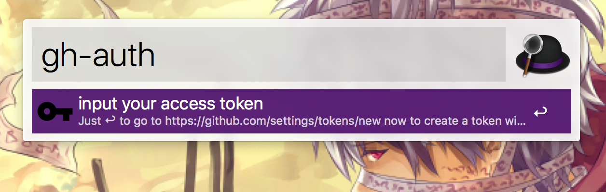
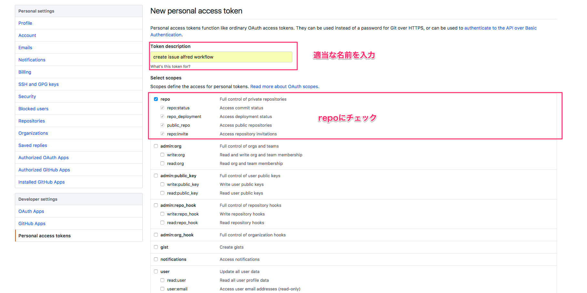
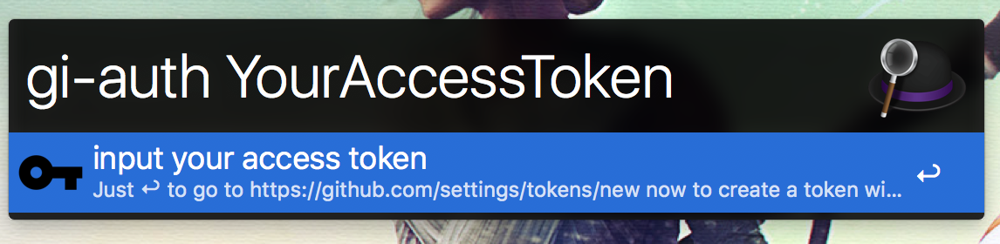
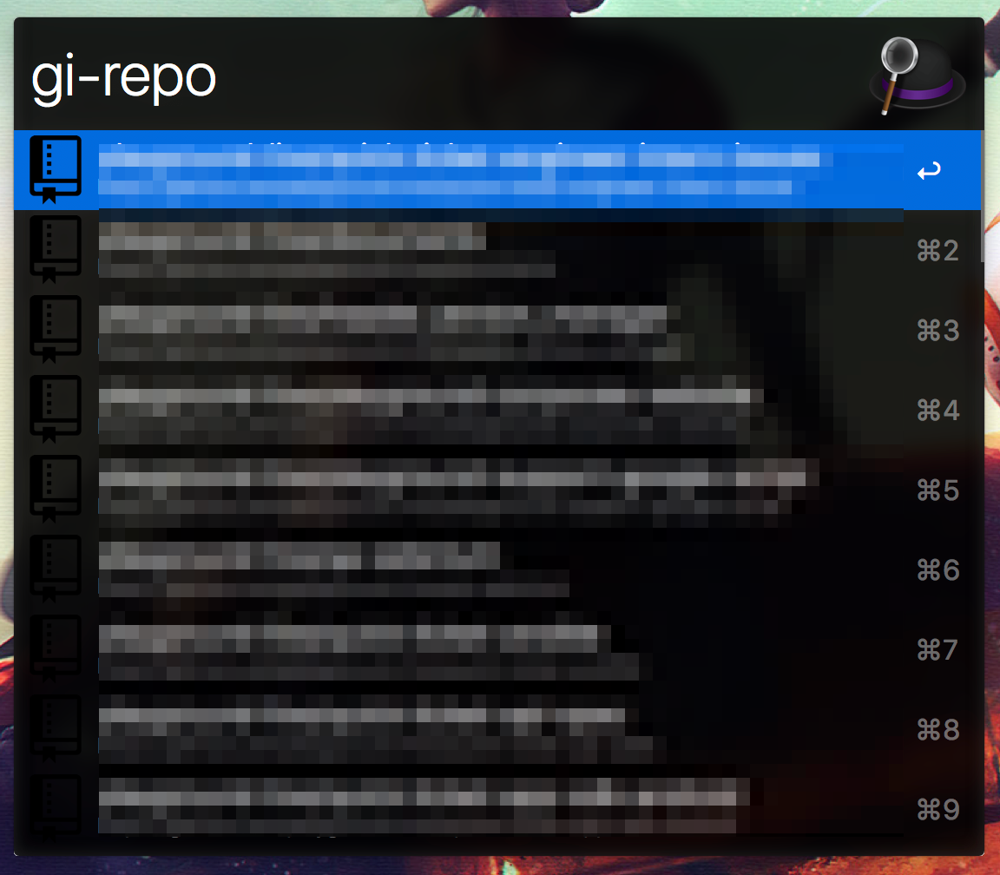
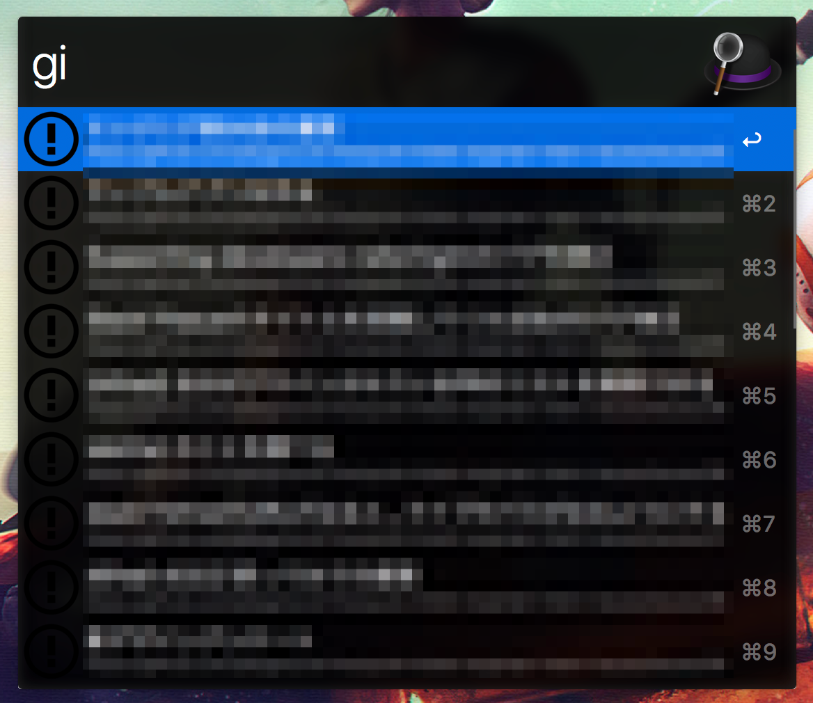
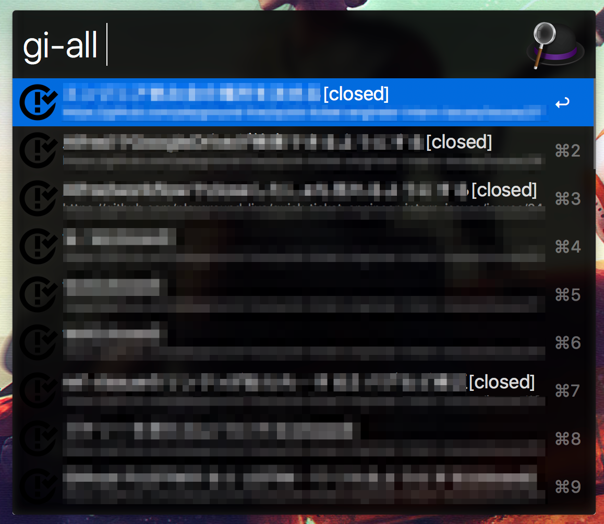
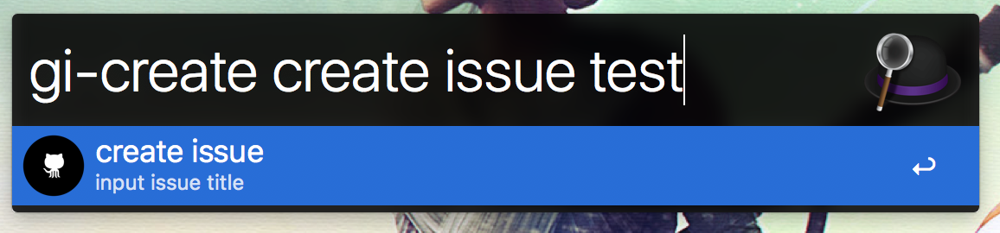
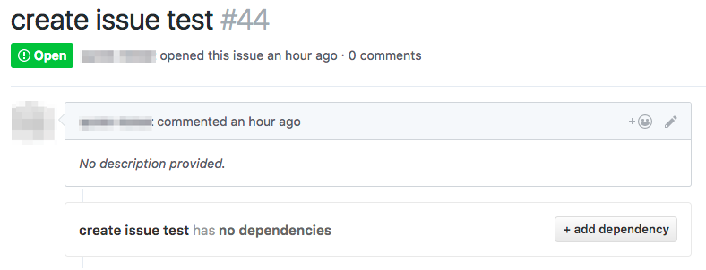
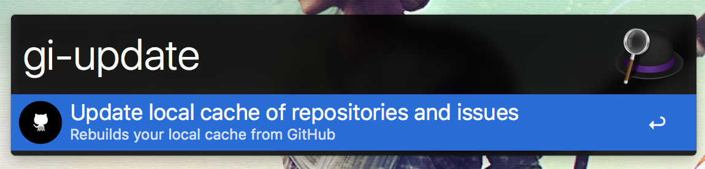

# Create issue

簡単にissueを作成できるalfred workflow

# 使い方

releaseからダウンロードしてください

## 認証
```
gi-auth
```
スペースを開けずにEnterを押すと、Githubのaccesstoken発行ページに遷移します


repo権限をつけたtokenを発行して、取得したtokenをコピーしてください



```
gi-auth 取得したtoken
```
取得したtokenを入力してください


## Repositoryを登録

どのRepositoryにIssueを作るか登録します
```
gi-repo issueを作りたいRepository
```



## issue検索
openになっているIssueを検索
```
gi 名前
```


## closeのIssueも検索
closeのIssueを含めて全て検索
```
gi-all 名前
```



## issue作成

```
gi-create issueの名前
```



issueが作成できました



## cacheのupdate
cacheがうまく更新されない場合、updateすることができます
```
gi-update
```



***

### 参考リンク
- Github API: https://developer.github.com/v3/issues/
- Alfred.GithubRepos: https://github.com/edgarjs/alfred-github-repos
- Ruby HTTP 通信: https://docs.ruby-lang.org/ja/latest/library/net=2fhttp.html
- HTTP context type: https://altarf.net/computer/ruby/2890
