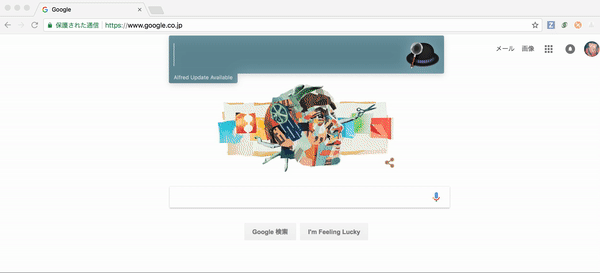
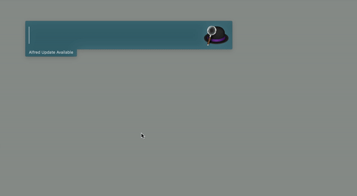

# Create issue

簡単にissueを作成できるalfred workflow

# 使い方

ダウンロードしてください

<a href="./Create issue.alfredworkflow?raw=true">ダウンロード</a>

## 概要

GitHub issueを検索と新規できるワークフローである。

出来る機能は：

- issue検索
- assigned-issue検索
- all-issue検索(closed issue含む)
- issue作成

## SetUp
- tokenの取得

repo権限のみをつけたtokenを発行して、取得したtokenをコピーする。



- tokenの登録

```
gi-auth 取得したtoken
```


- Repositoryを登録

どのRepositoryにIssueを作るか登録します
```
gi-repo
```



## 機能

- issue 検索
```
gi 名前
```


- all-issue 検索
```
gi-all 名前
```


- assigned-issue検索

```
gi-assigned 
```


- issue 作成

```
gi-create 
```


- cache の更新

起動するたびにissueの更新をチェックしますが、うまく更新できないときは `gi-update` を実行してみてください

```
gi-update
```


***
### 参考リンク
- Github API: https://developer.github.com/v3/issues/
- Alfred.GithubRepos: https://github.com/edgarjs/alfred-github-repos
- Ruby HTTP 通信: https://docs.ruby-lang.org/ja/latest/library/net=2fhttp.html
- HTTP context type: https://altarf.net/computer/ruby/2890


