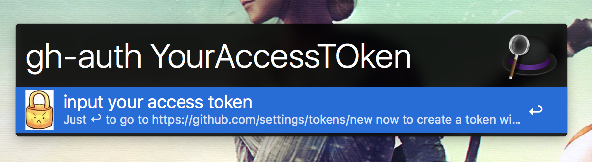
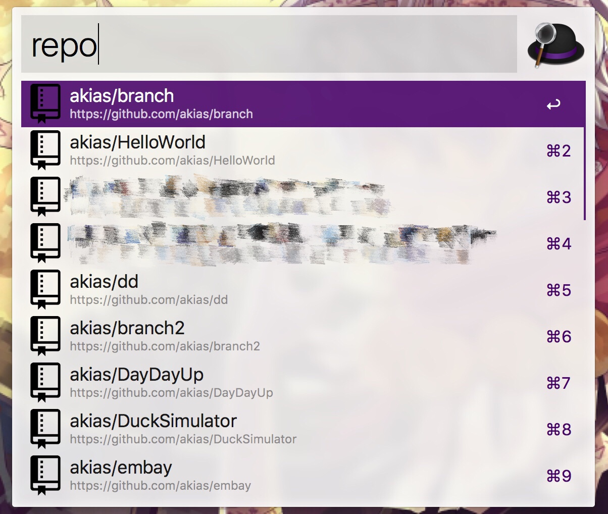
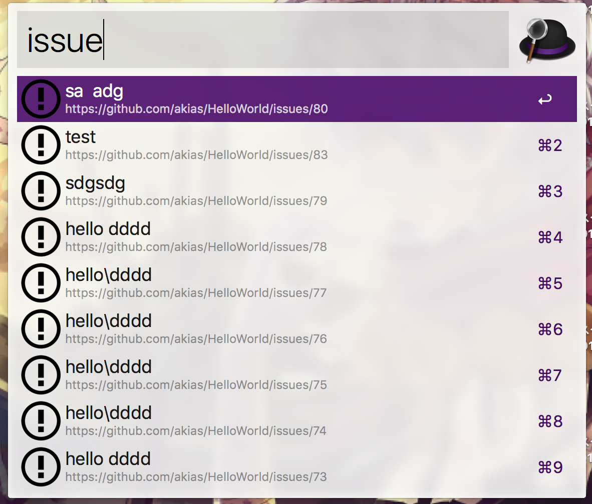
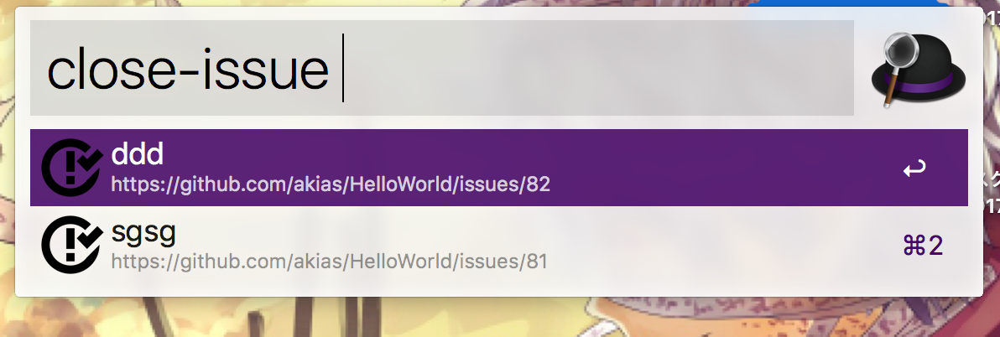
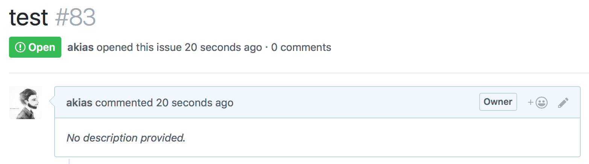
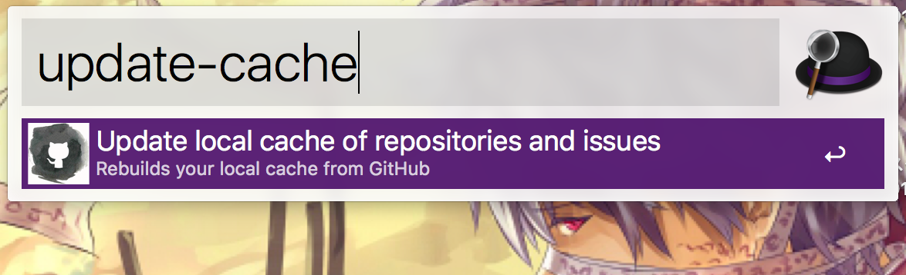

# Create issue

簡単にissueを作成できるalfred workflow

# 使い方

ダウンロードしてください

<a href="./Create issue.alfredworkflow?raw=true">ダウンロード</a>

## 認証
```
gh-auth
```


repo権限のみをつけたtokenを発行して、取得したtokenをコピーする


```
gh-auth 取得したtoken
```



## Repositoryを登録

どのRepositoryにIssueを作るか登録します
```
repo issueを作りたいRepository
```



## issue検索
```
issue 名前
```


## closed issue検索
```
close-issue 名前
```



## issue作成

```
create-issue issueの名前
```


issueが作成できました



## cacheのupdate

```
update-cache
```



***
### 参考リンク
- Github API: https://developer.github.com/v3/issues/
- Alfred.GithubRepos: https://github.com/edgarjs/alfred-github-repos
- Ruby HTTP 通信: https://docs.ruby-lang.org/ja/latest/library/net=2fhttp.html
- HTTP context type: https://altarf.net/computer/ruby/2890
***
### 開発

1. 修正
1. alfredでexport
1. exportしてできた.alfredworkflowファイルをこのディレクトリに移動(上書き)
1. push
