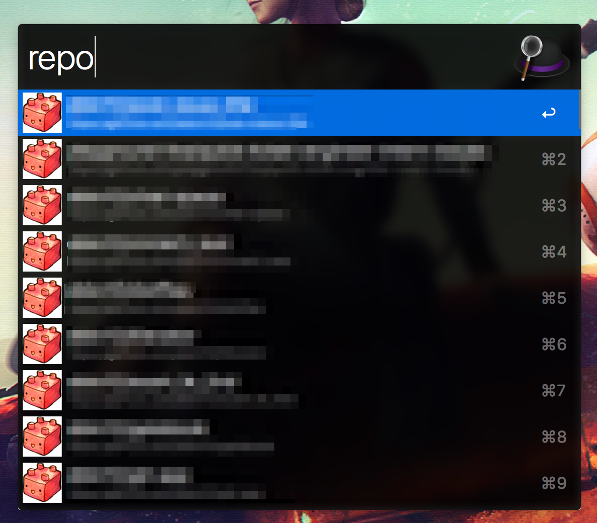

# Create issue

簡単にissueを作成できるalfred workflow

# 使い方

ダウンロードしてください

<a href="./Create issue.alfredworkflow?raw=true">ダウンロード</a>

## 認証
```
gh-auth
```


repo権限のみをつけたtokenを発行して、取得したtokenをコピーする


```
gh-auth 取得したtoken
```


## Repositoryを登録

どのRepositoryにIssueを作るか登録します
```
repo issueを作りたいRepository
```



## issue検索
```
issue 名前
```


## issue作成

```
create-issue issueの名前
```


issueが作成できました


## cacheのupdate

```
update-cache
```


***

### 開発

1. 修正
1. alfredでexport
1. exportしてできた.alfredworkflowファイルをこのディレクトリに移動(上書き)
1. push
